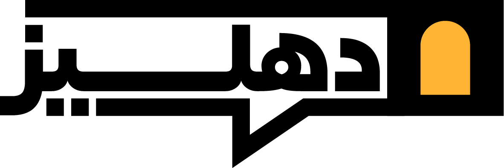

<div dir="rtl">

<p align="right">
  
</p>

# دهليز - Dahliz
مشروع يهدف للتوعية بالتضليل وتوثيق أبرز الحسابات المتورطة في نشره في المجتمع السوري.

## المساهمة في المشروع

يرجى إرسال الأفكار والاقتراحات من خلال إنشاء issues لمناقشتها والاتفاق عليها.

## تطوير

تم إنشاء الموقع باستخدام [SvelteKit](https://kit.svelte.dev/). يمكنك تشغيله على جهازك من خلال:
1. تثبيت [Node.js](https://nodejs.org/) (يفضل الإصدار 18 أو أحدث).
2. تثبيت الأدوات اللازمة من خلال سطر الأوامر:
    
    ```sh
    npm install
    ```
3. تشغيل خادم التطوير:
    
    ```sh
    npm run dev
    ```
## المصادر
- الأيقونات: [Akar Icons by Arturo Wibawa](https://github.com/artcoholic/akar-icons)

## الرخصة
المشروع مرخص تحت رخصة MIT. راجع ملف `LICENSE` لمزيد من التفاصيل.

</div>